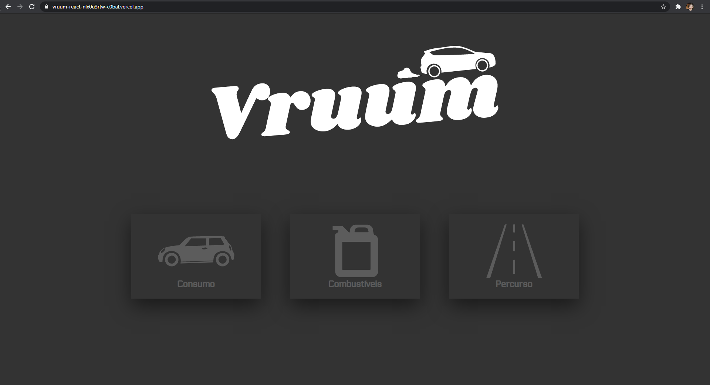

<h1 align="center">
  
</h1>

## 🧪 Technologies

This project was developed using the following technologies:

- [Next.js](https://nextjs.org/)
- [React](https://reactjs.org)
- [TypeScript](https://www.typescriptlang.org/)

## 🔥 Preview

[](https://vruum-react.vercel.app/)

## 🚀 Getting started

Clone the project and access the folder

```bash
$ git clone https://github.com/C0bal/reactjs-vruum && cd reactjs-vruum
```

Use the [yarn](https://classic.yarnpkg.com/en/docs/install/#windows-stable) to install dependences, follow the steps below.

```bash
# Install the dependencies
$ yarn

# Start the project
$ yarn dev
```

## 💻 Project

[Vruum](https://github.com/C0bal/vruum-react) is a simple website with some functions, such as calculating the consumption of your car, what is the most economical fuel and also how much money you would spend on a trip.

## 📝 License

This project is licensed under the MIT License. See the [LICENSE](LICENSE.md) file for details.

---

Projected by Rafael Menegon
